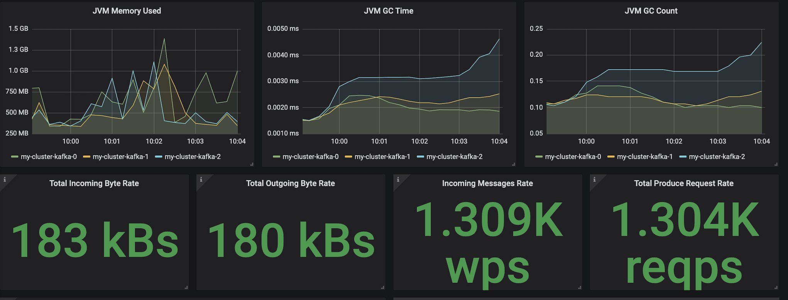

# amq-streams-benchmarking
Tested on OpenShift v4.5

## Deploy Kafka:
Run ```./deploy_kafka.sh```

The bash script will prompt for a namespace name which creates the namespace; and makes changes to the yaml files.

## Deploy Metrics:
Run ```./deploy_metrics.sh```

The bash script will prompt for a namespace name which navigates into the namespace; and makes changes to the yaml files

Navigate to Grafana route, login with ```admin:admin```. Once logged in, follow through the console instruction to change password. 

Add a new data source with http://prometheus-operated:9090 with the rest of the parameters stay as default.

Import a new dashboard, *../grafana-dashboards/strimzi-kafka.json*


## Load Test
Load Test
```bash
cd test-scripts
./load-test.sh
```

## Deploy Sample Application

Original code here [https://github.com/redhat-developer-demos/kafka-tutorial.git](https://github.com/redhat-developer-demos/kafka-tutorial.git)

### Deploy Producer Application
Deploy songs app
```bash
oc new-project songs --display-name="Songs Application"
oc apply -f kafka-songs-topic.yaml -n kafka
oc apply -f applications/song-app/src/main/kubernetes/kubernetes.yml -n songs
oc create route edge song --service=kafka-tutorial-song-app --port=8080 -n songs
oc rollout pause deployment kafka-tutorial-song-app -n songs
## You need to change "kafka" to match your AMQ Streams project
oc set env deployment/kafka-tutorial-song-app MP_MESSAGING_OUTGOING_SONGS_BOOTSTRAP_SERVERS=my-cluster-kafka-bootstrap.kafka.svc.cluster.local:9092 -n songs
oc set resources deployment kafka-tutorial-song-app  --limits="cpu=50m,memory=120Mi" -n songs
oc set resources deployment kafka-tutorial-song-app  --requests="cpu=10m,memory=80Mi" -n songs
oc scale deployment kafka-tutorial-song-app --replicas=100 -n songs
oc rollout resume deployment kafka-tutorial-song-app -n songs
```
Test 
```bash
SONG=https://$(oc get route song -n songs -o jsonpath='{.spec.host}')/songs
curl -v -X POST -H "Content-Type: application/json" -d @test-scripts/uprising.json ${SONG}
```
Sample result
```bash
...
HTTP/1.1 204 No Content
...
```
### Deploy Consumer Application
Deploy songs-indexder app
```bash
oc apply -f applications/song-indexer-app/src/main/kubernetes/kubernetes.yml -n songs
oc create route edge song-indexer --service=kafka-tutorial-song-indexer-app -n songs
## You need to change "kafka" to match your AMQ Streams project
oc set env deployment/kafka-tutorial-song-indexer-app MP_MESSAGING_INCOMING_SONGS_BOOTSTRAP_SERVERS=my-cluster-kafka-bootstrap.kafka.svc.cluster.local:9092 -n songs
```
Test 
```bash
INDEXER=https://$(oc get route song-indexer -n songs -o jsonpath='{.spec.host}')/events
curl -X GET -v ${INDEXER}
```
### Load Test with k6
Edit [test-scripts/load-test-k6.js](test-scripts/load-test-k6.js). Replace url to your song app URL
```js
export default function() {
  const url = 'https://song-songs.apps.cluster-f2cc.f2cc.example.opentlc.com/songs';
  let headers = {'Content-Type': 'application/json'};
```
Run Load test with k6
```bash
docker run -i loadimpact/k6 run -< test-scripts/load-test-k6.js
```
Remark: Run Test Consumer in another terminal

Check Grafana Dashboard



